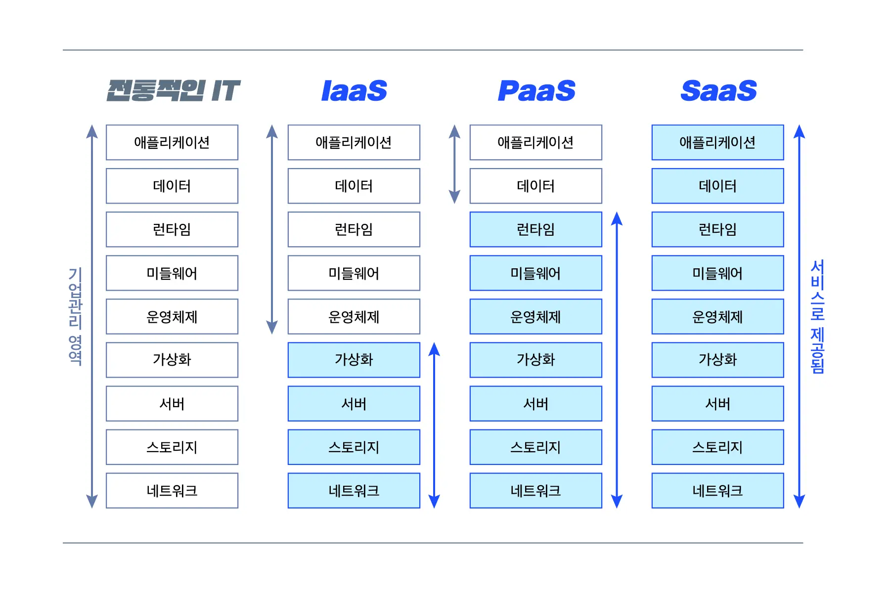

# 클라우드란

AWS, Azure,GCP가 대중화되면서 클라우드를 인프라스트럭처의 가상화 개념으로만 이해하기도 하지만 클라우드는 인프라스트럭처 뿐만이 아니라 플랫폼과 소프트까지 포함하는 온라인의 모든 영역을 다루는 꽤 광범위한 개념입니다. 그렇기 때문에 클라우드는 분야별 특성별로 나누어서 이해가 필요하다.

클라우드는 그 형태에 따라서 아래와 같은 몇가지 형태로 나뉘어 진다.&#x20;

* Infrastructure as a Service(IaaS, 아이아스, 이에스)서비스로 제공되는 인프라스트럭처입니다. 개발사에 제공되는 물리적 자원을 가상화합니다.
* Platform as a Service(PaaS, 파스)서비스로 제공되는 플랫폼입니다. 개발사에 제공되는 플랫폼을 가상화합니다.
* Software as a Service(SaaS, 사스)서비스로 제공되는 소프트웨어입니다. 고객에게 제공되는 소프트웨어를 가상화합니다.

일반적인 시스템 개발자 입장에서는 가장 많이 사용하는 부분이 Saas형태의 서비스이나 Saas를 Cloud환경에 적용하면서 자동으로 Iaas 및 Paas환경을 사용하게 된다.

<figure><figcaption></figcaption></figure>

1.  IaaS : 물리적 자원 제공

    IaaS는 고객에게 서버, 네트워크, OS, 스토리지를 가상화하여 제공하고 관리합니다. IaaS는 가상화된 물리적인 자산을 UI 형태의 대시보드 또는 API로 제공합니다. IaaS의 고객들은 서버와 스토리지를 접근할 수 있지만 사실상 클라우드에 있는 가상 데이터 센터를 통해 리소스를 전달받는 형태입니다. IaaS는 기존의 데이터센터에서 제공받던 물리적인 자산을 완벽하게 가상화하여 제공하기 때문에 서버 사양의 변경 등 물리적 자산의 수정이 필요한 경우 기존의 방식에 비해 훨씬 빠른 대응이 가능합니다.

    IaaS의 제공업체는 서버, 하드 드라이브, 네트워킹, 가상화 및 스토리지를 관리하며 고객은 OS, 미들웨어, 애플리케이션 및 데이터와 같은 자원들을 관리해야 합니다.
2.  PaaS : 소프트웨어 개발을 돕는 플랫폼 제공

    PaaS는 고객에게 OS, 미들웨어, 런타임과 같은 소프트웨어 작성을 위한 플랫폼을 가상화하여 제공하고 관리합니다. 이 가상화된 플랫폼은 웹을 통해 제공되며 개발자는 운영체제, 소프트웨어 업데이트, 저장소 또는 인프라에 대한 관리없이 소프트웨어 개발에 집중할 수 있습니다.

    PaaS를 사용하면 기업에서는 특수 소프트웨어 구성 요소를 사용하여 PaaS에 내장된 응용 프로스램을 설계하고 만들 수 있습니다. 이러한 응용 프로그램 또는 미들웨어는 특정 클라우드 특성을 채택할 때 확장 가능하고 가용성이 높습니다.
3.  SaaS : 고객이 사용하는 소프트웨어 제공

    SaaS는 고객을 대신하여 소프트웨어와 데이터를 제공하고 관리합니다. 패키지 또는 On-premise 방식인 기존의 소프트웨어 전달 방식과 다르게 SaaS는 개별 컴퓨터에 응용 프로그램을 다운로드하고 설치할 필요가 없습니다. SaaS를 통해 서비스를 공급하는 업체는 데이터, 미들웨어, 서버 및 스토리지와 같은 모든 잠재적인 기술적 문제를 관리하기 때문에 고객은 유지 보수 및 자원을 간소화하면서 비즈니스에 집중할 수 있습니다.

\
