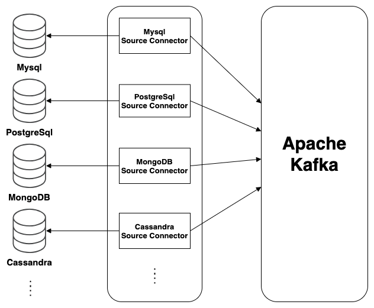

# CQRS

## CQRS Pattern ?
  
* Command and Query Responsibility Segregation
  - CQRS는 데이터 저장소에 대한 읽기 및 업데이트 작업을 구분하는 패턴인 명령과 쿼리의 역할 분리 즉, 명령과 조회의 책임을 분리하는 것을 의미

* 애플리케이션에서 CQRS를 구현하면 성능, 확장성 및 보안을 최대화

* CQRS로 마이그레이션하여 생성되는 유연성을 통해 시스템은 시간이 지남에 따라 개선되고 업데이트 명령으로 인해 도메인 수준에서 병합 충돌이 발생하지 않도록 방지 가능

---

* 기존 패턴

 

---

* CQRS패턴


---
* CQRS의 이점
  - **독립적인 크기 조정 :** CQRS를 통해 읽기 및 쓰기 워크로드를 독립적으로 확장하고 더 적은 수의 LOCK 발생
  - **최적화된 데이터 스키마 :** 읽기 쪽에서는 쿼리에 최적화된 DB또는 스키마를 사용하는 반면 쓰기 쪽에서는 업데이트에 최적화된 DB또는 스키마를 사용 가능.예) 쓰기 데이터베이스는 RDB 및 index 최소화하여 쓰기 성능 향상, 읽기 데이터는 검색 엔진(Elastic Search 등) 또는 Document Based DB(Mongo 등).
  - **단순한 쿼리:** 읽기 데이터베이스에서 구체화된 뷰 또는 문서를 저장하여 쿼리할 때 애플리케이션은 복잡한 조인을 방지 가능.
    이 부분에서 읽기 데이터를 저장할때 가능한 관련된 내용도 포함하여 저장하여야 읽기 속도를 최대로 향상 가능함, 예를 들면 Master/Detail구조의 one to many관계
-----

* Event Driven Architecture을 활용한 CQRS
  *    Event Driven Architecture Style
       
  * Kafka Flow
    
  * CDC With Kafka
    
    keyword : 
    
    ```
    AWS,
    confluentinc,
    confluent-hub, 
    cp-kafka-connect-base, 
    kafka-connect-elasticsearch-source
    kafka-connect-elasticsearch
    ....
    ```