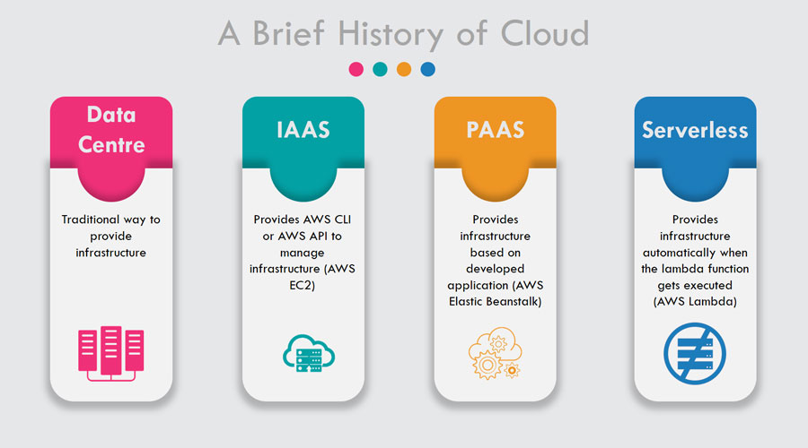

# 클라우드란

AWS, Azure,GCP가 대중화되면서 클라우드를 인프라스트럭처의 가상화 개념으로만 이해하기도 하지만 클라우드는 인프라스트럭처 뿐만이 아니라 플랫폼과 소프트까지 포함하는 온라인의 모든 영역을 다루는 꽤 광범위한 개념입니다. 그렇기 때문에 클라우드는 분야별 특성별로 나누어서 이해가 필요하다.

클라우드는 그 형태에 따라서 아래와 같은 몇가지 형태로 나뉘어 진다.&#x20;

* Infrastructure as a Service(IaaS, 아이아스, 이에스)서비스로 제공되는 인프라스트럭처입니다. 개발사에 제공되는 물리적 자원을 가상화합니다.
* Platform as a Service(PaaS, 파스)서비스로 제공되는 플랫폼입니다. 개발사에 제공되는 플랫폼을 가상화합니다.
* Software as a Service(SaaS, 사스)서비스로 제공되는 소프트웨어입니다. 고객에게 제공되는 소프트웨어를 가상화합니다.

일반적인 시스템 개발자 입장에서는 가장 많이 사용하는 부분이 Saas형태의 서비스이나 Saas를 Cloud환경에 적용하면서 자동으로 Iaas 및 Paas환경을 사용하게 된다.

<figure><figcaption></figcaption></figure>

